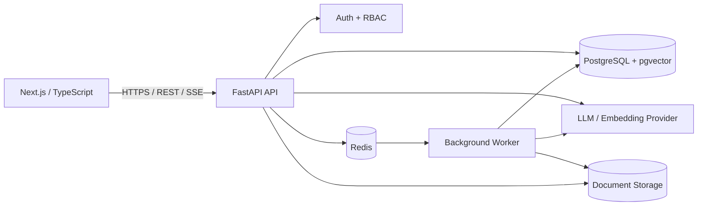
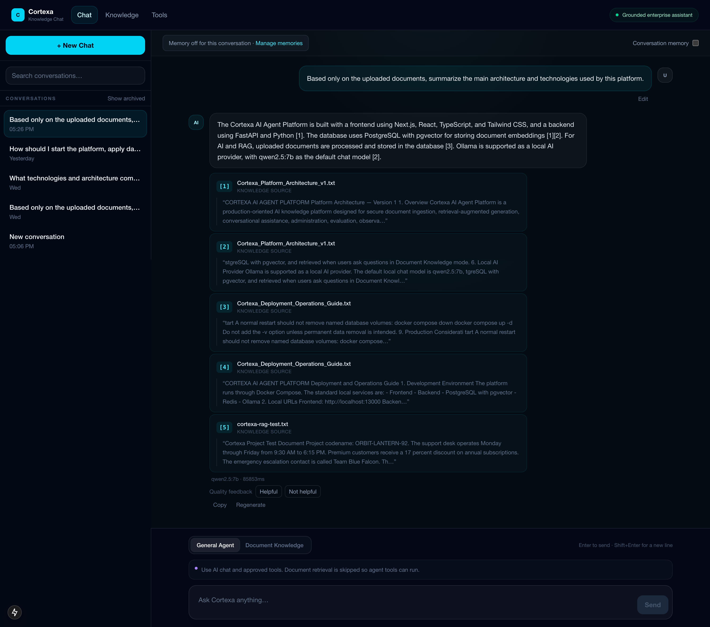
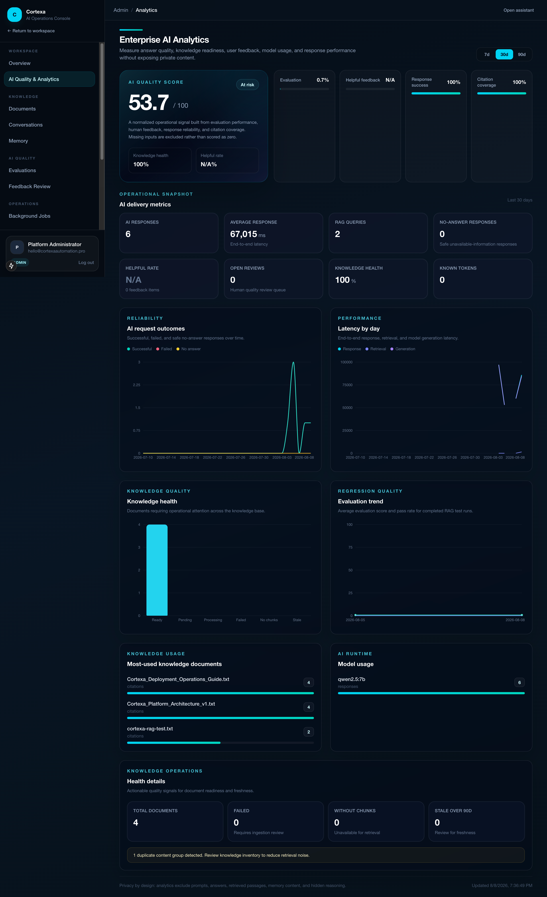
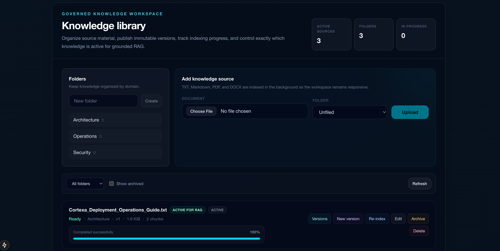
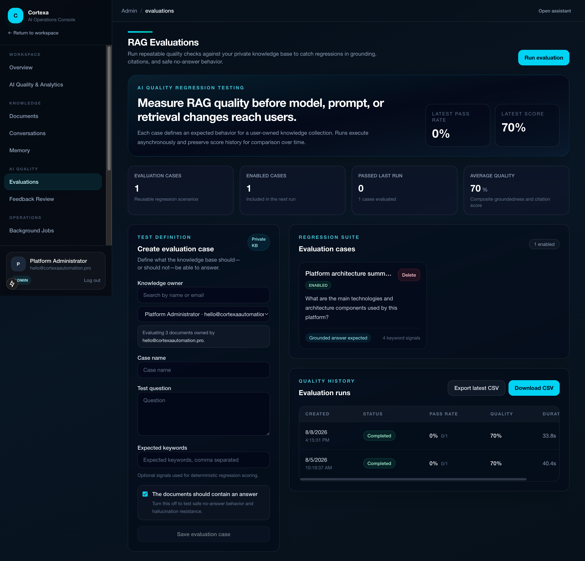
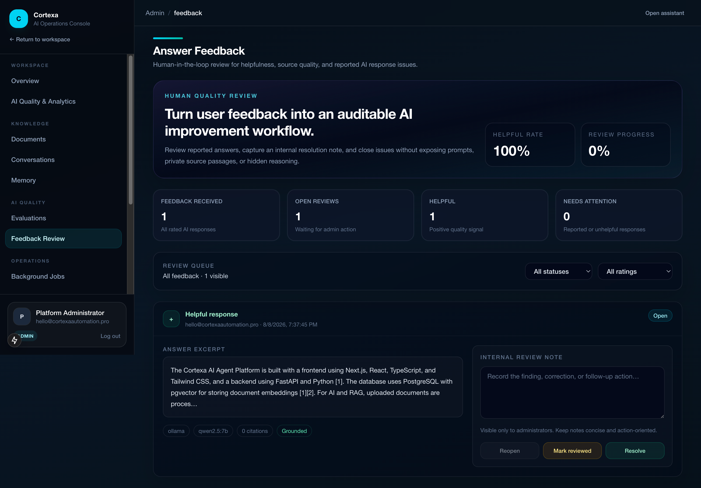
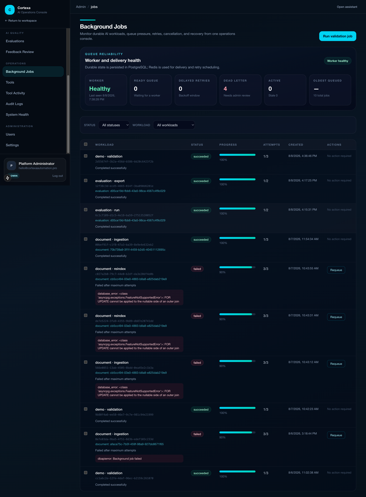
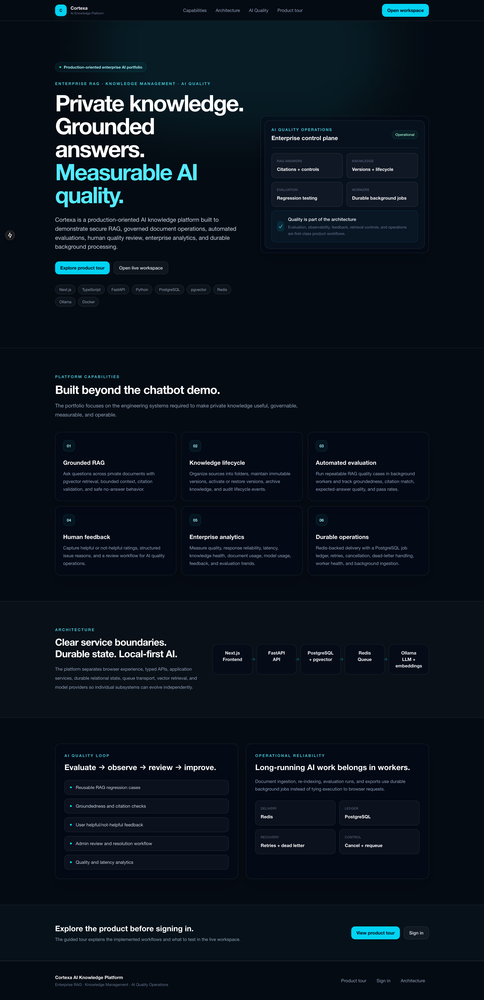
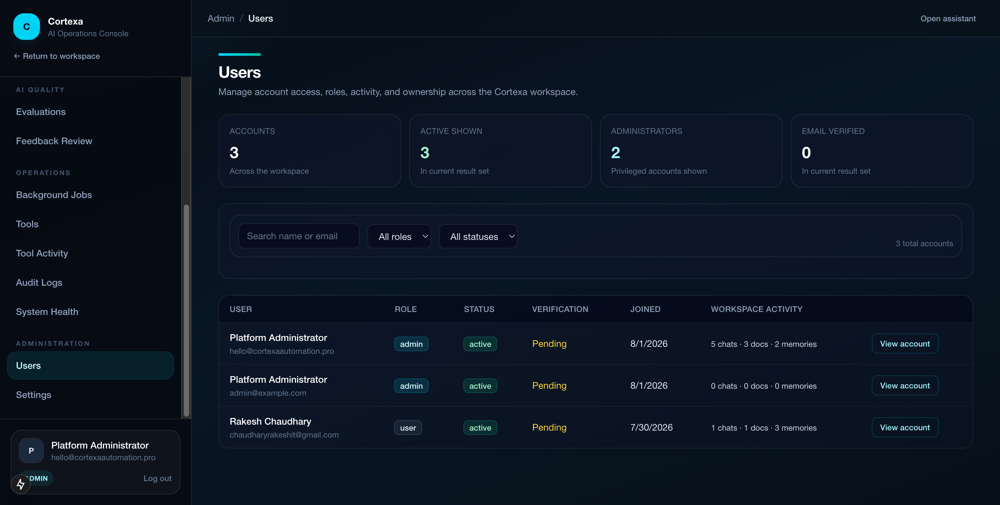
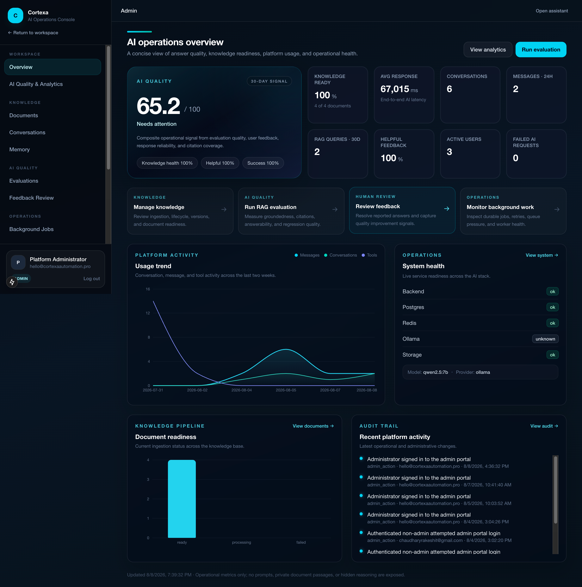

# Cortexa AI Knowledge Platform

**Enterprise RAG · Knowledge Management · AI Quality Operations**

Cortexa is a production-oriented AI engineering portfolio project for turning private documents into a governed, measurable knowledge system. It combines grounded RAG chat, document lifecycle/versioning, automated quality evaluation, human feedback review, enterprise analytics, and durable background processing in one SaaS-style platform.

> Built to demonstrate senior-level AI/backend engineering beyond a chatbot demo: FastAPI, Next.js, PostgreSQL/pgvector, Redis workers, RAG evaluation, observability, governance, and operational tooling.

## Product highlights

- **Grounded knowledge chat** with document citations and safe no-answer behavior
- **Knowledge governance** with folders, archive/restore, immutable versions, active-version retrieval, and lifecycle history
- **Background AI workloads** for document ingestion, re-indexing, evaluation runs, and CSV exports
- **RAG evaluation framework** with reusable test cases, quality scores, pass rates, and regression history
- **Human feedback loop** with Helpful / Not helpful review, issue reasons, admin notes, and resolution workflow
- **Enterprise analytics** for AI quality, knowledge health, latency, citations, feedback, model usage, and reliability
- **Operations console** for worker health, queue depth, retries, cancellation, dead-letter handling, and requeue
- **Authentication and RBAC** with protected user/admin experiences and owner-scoped knowledge access

## Public portfolio routes

| Route | Experience |
| --- | --- |
| `/` | Public product landing page |
| `/demo` | Guided product tour |
| `/login` | Authentication |
| `/workspace` | Authenticated knowledge workspace |
| `/chat` | Grounded knowledge chat |
| `/admin` | Enterprise admin dashboard |
| `/admin/analytics` | AI quality and operational analytics |
| `/admin/evaluations` | Automated RAG regression testing |
| `/admin/feedback` | Human-in-the-loop answer review |
| `/admin/jobs` | Background operations console |

## Architecture



The API owns short request/response workflows. Long-running ingestion, indexing, evaluation, and export work is represented durably in PostgreSQL and delivered through Redis to an independent worker.

See [Architecture Diagrams](docs/ARCHITECTURE_DIAGRAMS.md) and [System Architecture](docs/ARCHITECTURE.md) for the detailed flows.

## Tech stack

| Area | Technology |
| --- | --- |
| Frontend | Next.js, React, TypeScript, Tailwind CSS |
| API | FastAPI, Python, Pydantic |
| Persistence | PostgreSQL, SQLAlchemy, Alembic |
| Vector search | pgvector |
| Queue | Redis + durable PostgreSQL job ledger |
| Local AI | Ollama (`qwen2.5:7b`, `nomic-embed-text`) |
| Runtime | Docker Compose |
| Quality | Pytest, Ruff, type checks, frontend tests/build, repository validation |

## Quick start

### 1. Configure

```bash
cp .env.example .env
```

For public or shared deployments, replace all placeholder secrets and enable secure cookie/HTTPS settings before exposing the application.

### 2. Start services

```bash
docker compose up -d --build
```

### 3. Pull local models

```bash
docker compose exec ollama ollama pull qwen2.5:7b
docker compose exec ollama ollama pull nomic-embed-text
```

### 4. Verify

```bash
docker compose ps
curl -fsS http://localhost:18000/health
curl -fsS http://localhost:18000/ready
```

Open `http://localhost:13000/`.

For detailed setup and production considerations, see [Deployment Guide](docs/DEPLOYMENT.md).

### Production/demo deployment

A separate production-oriented Compose topology, standalone Next.js image and HTTPS Caddy ingress are included for a controlled live portfolio deployment. See [Live Demo Deployment](docs/LIVE_DEMO_DEPLOYMENT.md) and [GitHub Publishing](docs/GITHUB_PUBLISHING.md).

## Demo workflow

A safe demo knowledge pack is included under [`demo/knowledge`](demo/knowledge).

Recommended walkthrough:

1. Upload the demo documents from the Knowledge Library.
2. Ask in Document Knowledge mode:
   > How is Cortexa architected and how does it keep AI quality measurable?
3. Show grounded citations.
4. Run a RAG evaluation.
5. Show AI Quality Analytics.
6. Submit and review answer feedback.
7. Show background ingestion/evaluation jobs in Operations.

See [Demo Guide](docs/DEMO_GUIDE.md) for a repeatable portfolio script.

## Documentation

- [Architecture](docs/ARCHITECTURE.md)
- [Architecture Diagrams](docs/ARCHITECTURE_DIAGRAMS.md)
- [API Overview](docs/API_OVERVIEW.md)
- [RAG & Retrieval](docs/RAG.md)
- [Authentication](docs/AUTHENTICATION.md)
- [Security Model](docs/SECURITY.md)
- [Deployment Guide](docs/DEPLOYMENT.md)
- [Demo Guide](docs/DEMO_GUIDE.md)
- [Portfolio Case Study](docs/PORTFOLIO_CASE_STUDY.md)
- [GitHub Publication Checklist](docs/GITHUB_PUBLICATION_CHECKLIST.md)
- [GitHub Publishing Guide](docs/GITHUB_PUBLISHING.md)
- [Live Demo Deployment](docs/LIVE_DEMO_DEPLOYMENT.md)
- [Portfolio Release Checklist](docs/RELEASE_CHECKLIST.md)
- [Documentation Index](docs/README.md)

Historical implementation notes are intentionally separated under `docs/archive/development-history/` so the public documentation stays focused on the current product.

## Validation

```bash
make validate
```

The project validation gate covers repository safety, backend lint/type/tests, frontend checks/build, migrations, service health, authentication, and smoke tests.

## Security and privacy

Cortexa is designed to avoid exposing system prompts, hidden reasoning, raw provider payloads, credentials, or full retrieved passages through analytics and admin quality workflows. Document retrieval remains owner-scoped, and archived/superseded versions are excluded from active RAG retrieval.

Read the full [Security Model](docs/SECURITY.md) before deploying outside local development.

## Portfolio positioning

This repository demonstrates practical engineering for roles involving:

**Python / FastAPI · RAG · pgvector · AI SaaS · Knowledge Assistants · LLM Evaluation · AI Observability · Background Processing · Enterprise Admin Systems**

The emphasis is on measurable, maintainable AI systems rather than prompt-only demos.

## Product showcase

These are real screenshots from the working Cortexa platform.

### Grounded RAG Knowledge Chat

Ask questions against private knowledge sources and receive grounded answers with document citations and controlled no-answer behavior.



---

### Enterprise AI Analytics

Monitor AI quality, knowledge health, evaluation performance, feedback, citations, latency, model usage, and operational reliability.



---

### Knowledge Library & Document Governance

Manage enterprise knowledge through document uploads, folders, metadata, lifecycle states, versioning, indexing, and active-version controls.



---

### Automated RAG Evaluation

Create reusable evaluation cases and execute regression tests against the RAG pipeline to measure answer quality over time.



---

### Human-in-the-Loop Feedback Review

Capture user feedback, investigate problematic AI responses, add administrator notes, and move issues through review and resolution workflows.



---

### Background Jobs & AI Operations

Monitor asynchronous ingestion and evaluation workloads with worker health, progress tracking, retries, cancellation, dead-letter handling, and administrative requeue controls.



<details>
<summary><strong>View additional platform screenshots</strong></summary>

### Public Product Experience



### User Administration



### Enterprise Admin Dashboard



</details>

## License

Proprietary — all rights reserved unless otherwise stated. Public source availability does not grant reuse, redistribution, or commercial rights.
