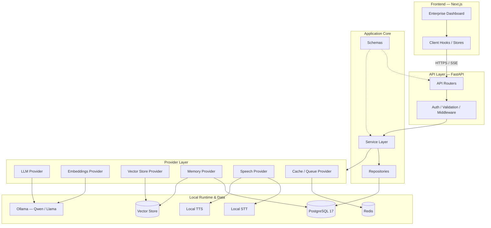
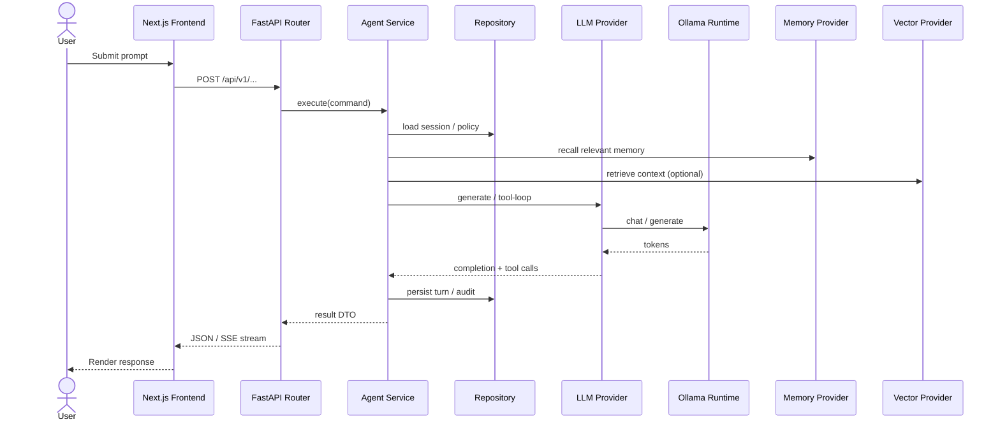
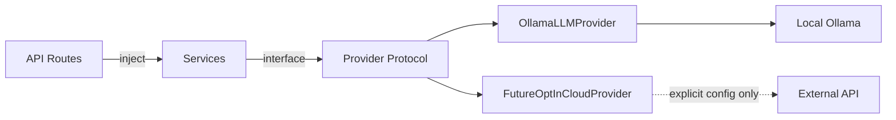
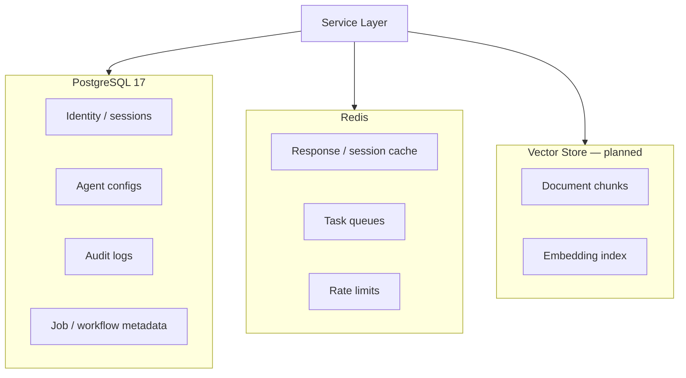
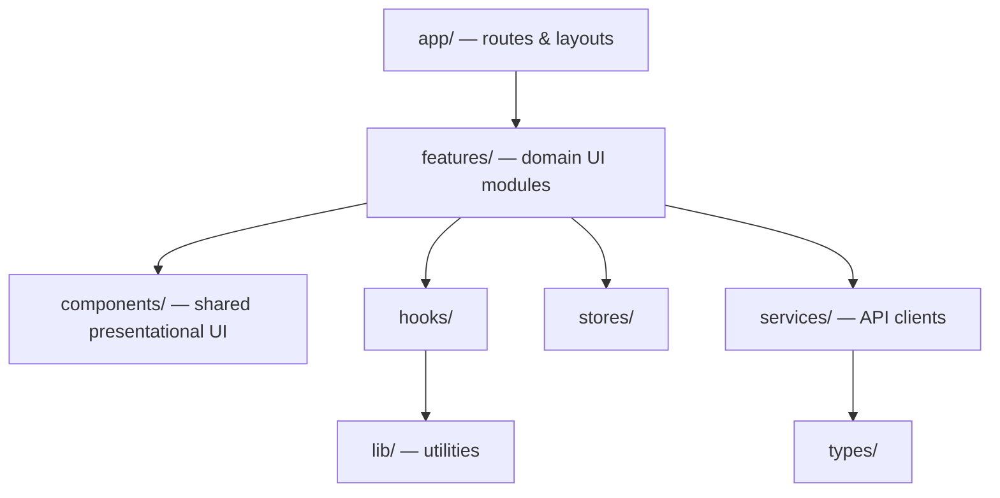

# Architecture

Cortexa AI Agent Platform — system architecture (Phase 0 design contract).

This document describes the **target** layered architecture. Runtime code that implements these layers is introduced in later phases. Phase 0 defines boundaries only.

---

## Design Principles

1. **Clean Architecture** — dependencies point inward toward domain/services; frameworks sit at the edges.
2. **Dependency Injection** — services receive repositories and providers through constructors / DI containers, not globals.
3. **Repository Pattern** — persistence is abstracted; services never issue raw SQL or ORM calls.
4. **Provider Pattern** — every external system (Ollama, vector DB, speech, object storage) is accessed through a provider interface.
5. **SOLID** — small, single-purpose modules with stable interfaces.
6. **Strong typing** — Pydantic / TypedDict on the backend; TypeScript strict on the frontend.

---

## Logical Stack

```
Frontend
    ↓
FastAPI
    ↓
Service Layer
    ↓
Provider Layer
    ↓
Local AI Runtime
    ↓
Database
    ↓
Vector Store
    ↓
Memory
    ↓
Speech
```

---

## Layer Responsibilities

| Layer | Responsibility | May call | Must not call |
| --- | --- | --- | --- |
| **Frontend** | UI, client state, API consumption | Backend HTTP/SSE APIs | Ollama, DB, Redis, filesystem secrets |
| **FastAPI (API)** | HTTP concerns, auth middleware, request validation, response mapping | Services | Providers, repositories, ORM, Ollama |
| **Service Layer** | Business rules, orchestration, transaction boundaries | Repositories, Providers, other services | Framework request objects, raw DB sessions outside UoW |
| **Provider Layer** | Adapt external APIs/SDKs to internal interfaces | Ollama, vector engines, STT/TTS, Redis clients | HTTP route handlers, UI |
| **Repositories** | CRUD / query mapping to persistence models | Database / ORM | Providers, HTTP |
| **Local AI Runtime** | Model inference via Ollama | Host GPU/CPU models | Application DB schema |
| **Database** | Relational state (users, sessions, audits, config) | — | — |
| **Vector Store** | Embedding indices for RAG | — | — |
| **Memory** | Short- and long-term conversational / agent memory | DB and/or vector store via services | Direct frontend access |
| **Speech** | STT / TTS pipelines | Local speech engines via providers | Cloud by default |

---

## Monorepo Topology

```text
cortexa-ai-agent-platform/
├── frontend/          # Next.js (App Router), TypeScript
├── backend/           # FastAPI, Python 3.12
│   ├── api/           # Route handlers / routers only
│   ├── core/          # Config, DI, logging, shared primitives
│   ├── db/            # Engine, session, migrations wiring
│   ├── models/        # ORM / persistence models
│   ├── schemas/       # Pydantic request/response schemas
│   ├── services/      # Business logic
│   ├── repositories/  # Data access
│   ├── providers/     # External integrations
│   ├── workers/       # Async / background jobs
│   └── tests/
├── infrastructure/    # Compose extras, proxy, observability
├── scripts/           # Ops / validation
└── sample-data/       # Non-secret fixtures
```

---

## Primary Runtime Diagram



---

## Request Flow (Chat / Agent — Target)



---

## Provider Boundary (Mandatory)



**Rules**

- API routes never import Ollama clients.
- Services depend on protocols / abstract providers, not concrete SDKs.
- Switching a model backend changes provider wiring, not route code.

---

## Data Plane



---

## Frontend Architecture (Target)



Frontend talks only to the Cortexa backend. It does not embed model credentials or call Ollama.

---

## Infrastructure (Local Compose)

Planned Compose services (Phase 0 definitions only):

| Service | Role |
| --- | --- |
| `frontend` | Next.js UI |
| `backend` | FastAPI API |
| `postgres` | Primary relational store |
| `redis` | Cache / broker |
| `ollama` | Local model runtime |

Named volumes retain Postgres data, Redis data, and Ollama models across restarts.

---

## Explicit Non-Goals (Phase 0)

- No runnable FastAPI or Next.js application code
- No ORM models, migrations, or seed data with business meaning
- No Ollama client implementation
- No authentication implementation
- No placeholder “fake agent” endpoints

Architecture is the contract; later phases implement against it.
