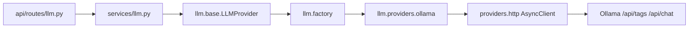

# Architecture

Cortexa AI Agent Platform — system architecture.

Phase 0 defined the design contract. Phase 1 delivered the application foundation. Phase 2 adds a provider-neutral LLM layer with Ollama as the first local provider. RAG, memory, tools, voice, and authentication remain unimplemented.

---

## Design Principles

1. **Clean Architecture** — dependencies point inward toward domain/services; frameworks sit at the edges.
2. **Dependency Injection** — services receive infrastructure collaborators through construction / app state, not ad-hoc globals in routes.
3. **Repository Pattern** — persistence is abstracted (domain repositories arrive with business tables in later phases).
4. **Provider Pattern** — every external system is accessed through a provider module (Redis; Ollama via `app/llm`).
5. **SOLID** — small, single-purpose modules with stable interfaces.
6. **Strong typing** — Pydantic v2 on the backend; TypeScript strict on the frontend.

---

## Phase 2 Runtime Stack

```
Frontend (Next.js system + LLM status)
        ↓  HTTP (NEXT_PUBLIC_API_BASE_URL)
FastAPI API routes
        ↓
Health / system / LLM services
        ↓
db/ + providers/redis + llm/providers/ollama
        ↓
PostgreSQL 17  |  Redis 7.4  |  Ollama
```

Backend talks to Ollama over the Compose network at `http://ollama:11434`. Host port `11435` is for optional host tooling only and is never hardcoded in application logic.

---

## Layer Responsibilities

| Layer | Responsibility | May call | Must not call |
| --- | --- | --- | --- |
| **Frontend** | System + LLM status UI | Backend HTTP APIs | Ollama, DB, Redis |
| **FastAPI (API)** | HTTP, CORS, validation, SSE | Services | DB engines, Redis, Ollama HTTP |
| **Service Layer** | Orchestration + request limits | Providers / LLM interface | Framework request objects for infra |
| **LLM providers** | Ollama transport + normalization | Ollama HTTP | Route handlers |
| **Provider Layer** | Redis / shared HTTP client | Redis / httpx | HTTP route handlers |
| **db/** | Async engine, sessions, `SELECT 1` | PostgreSQL | Providers, HTTP |

---

## Backend Package Layout (Phase 2)

```text
backend/
├── app/
│   ├── api/routes/     # health, system, llm
│   ├── core/           # config, exceptions, logging, lifespan
│   ├── db/             # base, session, health
│   ├── llm/            # provider protocol, factory, Ollama
│   ├── providers/      # redis, shared httpx client
│   ├── schemas/        # Pydantic DTOs
│   ├── services/       # health + llm services
│   └── main.py
├── alembic/
└── tests/              # includes tests/fakes for deterministic LLM fakes
```

---

## LLM Provider Abstraction



- Routes never construct `OllamaProvider` directly.
- Factory resolves `LLM_PROVIDER` (Phase 2: `ollama` only).
- Future OpenAI/Anthropic providers plug into the factory without rewriting API routes.

---

## Readiness vs LLM Status

| Endpoint | Purpose | Fails when |
| --- | --- | --- |
| `GET /health` | Process liveness | Process down |
| `GET /ready` | Essential infra readiness | PostgreSQL or Redis unhealthy |
| `GET /api/v1/llm/status` | AI provider/model diagnostics | Never fails readiness; reports provider/model state |

Ollama being down or the model missing does **not** make `/ready` return 503.

---

## LLM API Surface

| Method | Path | Purpose |
| --- | --- | --- |
| `GET` | `/api/v1/llm/status` | Provider reachability + model availability |
| `POST` | `/api/v1/llm/generate` | Non-streaming generation |
| `POST` | `/api/v1/llm/stream` | SSE streaming generation |

### SSE event schema

| Event | Data |
| --- | --- |
| `start` | `{provider, model}` |
| `delta` | `{content}` |
| `complete` | `{provider, model, content, finish_reason?, usage?, latency_ms?}` |
| `error` | `{code, message}` |

Raw Ollama payloads are never forwarded to clients.

---

## Error Mapping

| Condition | HTTP | Code |
| --- | --- | --- |
| Invalid client request / limits | 422 | `validation_error` / `llm_input_too_large` / `llm_max_tokens_exceeded` |
| Provider unreachable | 503 | `llm_provider_unavailable` |
| Model missing | 424 | `llm_model_unavailable` |
| Provider timeout | 504 | `llm_request_timeout` |
| Invalid upstream response | 502 | `llm_invalid_response` |
| Controlled generation failure | 502 | `llm_generation_error` |

All errors use the Phase 1 envelope: `{error:{code,message,details}, request_id}`.

---

## Frontend Architecture (Phase 2)

The Phase 1 status page remains. Phase 2 adds a compact **Local LLM status** section that reads `/api/v1/llm/status` only. No chat composer, history, RAG, memory, tools, or voice controls.
