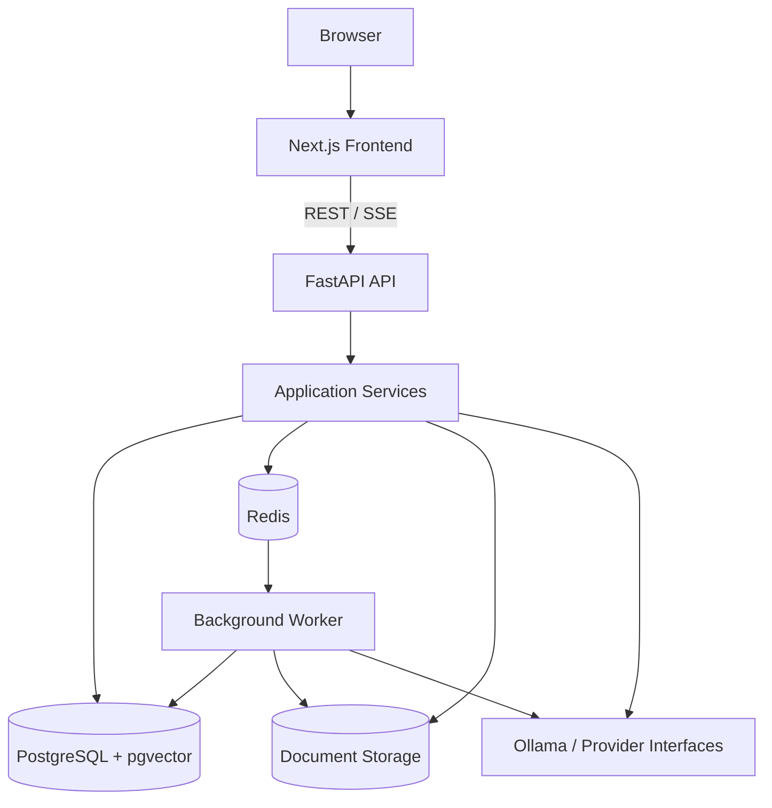

# System Architecture

Cortexa AI Knowledge Platform is a modular AI knowledge SaaS architecture built around five boundaries: browser experience, HTTP API, durable persistence, background execution, and provider integrations.

## Design principles

1. **Durable state over in-memory state** — conversations, document versions, evaluation results, feedback, and jobs persist in PostgreSQL.
2. **Request/worker separation** — long-running ingestion and evaluation workloads execute outside API request lifecycles.
3. **Owner-scoped knowledge access** — retrieval and document operations are scoped to the authenticated user unless an authorized admin workflow explicitly requires broader visibility.
4. **Provider boundaries** — LLM, embedding, Redis, storage, and database concerns stay behind service/provider layers.
5. **Measurable AI quality** — evaluation, feedback, latency, citation, and no-answer signals are persisted and observable.
6. **Governed retrieval** — only active, ready, non-archived document versions participate in RAG.
7. **Safe operations** — queue retries, cancellation, dead-letter handling, idempotency, and worker recovery are explicit product behavior.

## Runtime topology

Docker Compose runs six primary services: `frontend`, `backend`, `worker`, `postgres`, `redis`, and `ollama`.

## Backend layers

| Layer | Responsibility |
| --- | --- |
| `api/routes` | HTTP boundary, validation, authentication, response mapping |
| `services` | Business workflows: chat, RAG, documents, evaluations, analytics |
| `jobs` | Durable job creation, queue transport, worker execution and recovery |
| `models` | SQLAlchemy persistence models |
| `documents` | Extraction/chunking contracts |
| `embeddings` | Embedding provider abstraction |
| `llm` | LLM provider abstraction |
| `providers` | Shared infrastructure clients such as Redis/httpx |
| `security` | Password hashing, JWT and refresh-session helpers |
| `admin` | Admin policies/settings and safe operational helpers |

## Data domains

The primary persisted domains are:

- users and refresh sessions
- documents, chunks, folders, logical knowledge documents and lifecycle events
- conversations, messages and message citations
- long-term memories
- tools and tool executions
- RAG evaluation cases/runs/results
- user message feedback and admin review state
- durable background jobs
- audit/admin operational data

## Request-bound vs background work

### Request-bound

- authentication/session refresh
- conversation CRUD
- streaming chat generation
- retrieval/query orchestration
- analytics reads
- admin review actions

### Background worker

- document ingestion
- document re-indexing
- evaluation runs
- evaluation CSV exports
- queue recovery/retry handling

This separation keeps the browser responsive while AI/provider workloads continue independently.

## RAG invariants

A document version is eligible for retrieval only when it is owned by the requesting user and is ready, active, and not archived. Retrieval deduplicates repetitive passages, enforces a context budget, and validates citation markers against the citation set actually provided to the model.

See [RAG.md](RAG.md) and [ARCHITECTURE_DIAGRAMS.md](ARCHITECTURE_DIAGRAMS.md).

## Quality loop

Cortexa treats quality as a product workflow:

1. production chat produces measurable latency/retrieval/citation metadata;
2. reusable evaluation cases test RAG behavior;
3. users submit Helpful / Not helpful feedback;
4. admins review and resolve quality issues;
5. analytics combine evaluation, feedback, reliability, citation and knowledge-health signals.

## Operational model

Redis provides delivery, while PostgreSQL remains the durable job ledger. Job state includes progress, retries, cancellation, idempotency, heartbeat/lock metadata, failure state, and dead-letter/requeue operations. Redis loss therefore does not erase durable job history.

## Deployment boundary

The included Compose stack is optimized for local/demo environments. Production deployments should provide HTTPS termination, managed secrets, durable backups, monitored PostgreSQL/Redis, object storage where appropriate, and an independently scalable worker tier.

See [DEPLOYMENT.md](DEPLOYMENT.md).
