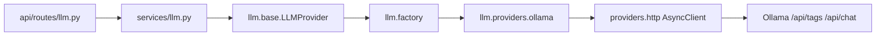
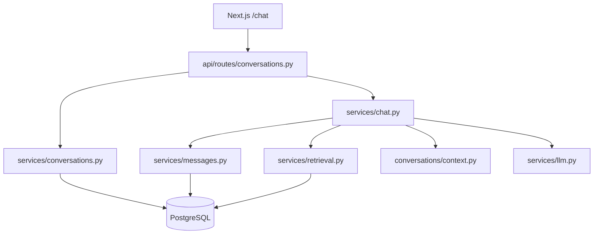

# Architecture

Cortexa AI Agent Platform — system architecture.

Phase 0 defined the design contract. Phase 1 delivered the application foundation. Phase 2 adds a provider-neutral LLM layer with Ollama as the first local provider. Phase 3 adds authentication and user sessions. Phase 4 adds documents, embeddings (pgvector), and grounded RAG. Phase 5 adds persistent conversations, multi-turn RAG chat, streaming, and the `/chat` UI. Agent tools, cross-conversation memory, and voice remain unimplemented.

---

## Design Principles

1. **Clean Architecture** — dependencies point inward toward domain/services; frameworks sit at the edges.
2. **Dependency Injection** — services receive infrastructure collaborators through construction / app state, not ad-hoc globals in routes.
3. **Repository Pattern** — persistence is abstracted (domain repositories arrive with business tables in later phases).
4. **Provider Pattern** — every external system is accessed through a provider module (Redis; Ollama via `app/llm`).
5. **SOLID** — small, single-purpose modules with stable interfaces.
6. **Strong typing** — Pydantic v2 on the backend; TypeScript strict on the frontend.

---

## Phase 5 Runtime Stack

```
Frontend (Next.js — status, auth, documents, /chat)
        ↓  HTTP + credentials (cookies) / Bearer access token
FastAPI API routes
        ↓
Auth / Health / system / LLM / Documents / RAG / Embeddings / Conversations / Chat services
        ↓
db/ models (users, refresh_sessions, documents, document_chunks, conversations, messages, message_citations)
+ storage/local + documents/* + embeddings/* + conversations/* + llm/providers/ollama
        ↓
PostgreSQL 17 + pgvector  |  Redis 7.4  |  Ollama (chat + embeddings)
```

Backend talks to Ollama over the Compose network at `http://ollama:11434`. Host port `11435` is for optional host tooling only and is never hardcoded in application logic.

---

## Layer Responsibilities

| Layer | Responsibility | May call | Must not call |
| --- | --- | --- | --- |
| **Frontend** | Status, auth, documents, chat UI | Backend HTTP APIs | Ollama, DB, Redis |
| **FastAPI (API)** | HTTP, CORS, validation, SSE | Services | DB engines, Redis, Ollama HTTP |
| **Service Layer** | Orchestration + request limits | Providers / LLM interface | Framework request objects for infra |
| **LLM providers** | Ollama transport + normalization | Ollama HTTP | Route handlers |
| **Provider Layer** | Redis / shared HTTP client | Redis / httpx | HTTP route handlers |
| **db/** | Async engine, sessions, `SELECT 1` | PostgreSQL | Providers, HTTP |

---

## Backend Package Layout (Phase 5)

```text
backend/
├── app/
│   ├── api/routes/     # health, system, llm, auth, documents, rag, embeddings, conversations
│   ├── api/deps.py     # auth + service deps (documents, rag, chat, conversations)
│   ├── conversations/  # schemas, context builder, domain exceptions
│   ├── core/           # config, exceptions, logging, lifespan
│   ├── db/             # base, session, health
│   ├── models/         # User, RefreshSession, Document, DocumentChunk, Conversation, Message, …
│   ├── security/       # passwords (Argon2id), JWT + refresh helpers
│   ├── documents/      # validation, extraction, chunking, schemas
│   ├── embeddings/     # provider protocol, factory, Ollama embeddings
│   ├── storage/        # local filesystem object storage
│   ├── llm/            # provider protocol, factory, Ollama chat
│   ├── providers/      # redis, shared httpx client
│   ├── schemas/        # Pydantic DTOs
│   ├── services/       # health, llm, auth, documents, retrieval, rag, embeddings, conversations, messages, chat
│   └── main.py
├── alembic/
└── tests/
```

Authentication details: [AUTHENTICATION.md](AUTHENTICATION.md).
Documents / RAG details: [RAG.md](RAG.md).
Conversations / chat: [CONVERSATIONS.md](CONVERSATIONS.md).

---

## LLM Provider Abstraction



- Routes never construct `OllamaProvider` directly.
- Factory resolves `LLM_PROVIDER` (Phase 2: `ollama` only).
- Future OpenAI/Anthropic providers plug into the factory without rewriting API routes.

---

## Readiness vs LLM Status

| Endpoint | Purpose | Fails when |
| --- | --- | --- |
| `GET /health`, `GET /health/live` | Process liveness | Process down |
| `GET /ready`, `GET /health/ready` | Essential infra readiness | PostgreSQL unreachable, Alembic behind head, required conversation tables missing, or Redis unhealthy |
| `GET /api/v1/llm/status` | AI provider/model diagnostics | Never fails readiness; reports provider/model state |

Ollama being down or the model missing does **not** make `/ready` return 503.

Backend containers apply `alembic upgrade head` in the entrypoint **before** Uvicorn creates the DB pool. After applying migrations to a running instance, **restart the backend** so asyncpg does not keep stale type/relation caches.

---

## LLM API Surface

| Method | Path | Purpose |
| --- | --- | --- |
| `GET` | `/api/v1/llm/status` | Provider reachability + model availability |
| `POST` | `/api/v1/llm/generate` | Non-streaming generation |
| `POST` | `/api/v1/llm/stream` | SSE streaming generation |

### SSE event schema

| Event | Data |
| --- | --- |
| `start` | `{provider, model}` |
| `delta` | `{content}` |
| `complete` | `{provider, model, content, finish_reason?, usage?, latency_ms?}` |
| `error` | `{code, message}` or `{error:{code,message}}` on conversation routes |

Conversation streams add `citation` and `metadata` events and a richer `complete` payload — see [CONVERSATIONS.md](CONVERSATIONS.md).

Raw Ollama payloads are never forwarded to clients.

---

## Conversation Architecture (Phase 5)



### Message lifecycle

1. **Send** — `require_active_conversation` (rejects archived). Optional idempotency via `client_request_id`.
2. **Persist user** — append with monotonic `sequence_number`; optional idempotency unique constraint.
3. **Assistant pending** — create `pending` assistant row before generation/stream.
4. **Retrieve** — scope from `document_ids` (all docs / none / subset); see [CONVERSATIONS.md](CONVERSATIONS.md).
5. **Build context** — priority: current message → RAG → history → summary → trim oldest.
6. **Generate** — LLM call, or no-context fallback without LLM when retrieval ran but returned no chunks.
7. **Finalize** — store content, citations (`MessageCitation` snapshots), usage fields, `grounded` flag.
8. **Post-turn** — optional auto-title (first assistant only) and rolling summary (failures non-fatal).

### Edit / regenerate

- **Edit** supersedes the latest user message and following active turns; does not auto-reply.
- **Regenerate** supersedes the latest assistant only; reuses the latest user message.

### Ownership

All conversation routes resolve resources by `(user_id, conversation_id)` (and message ownership). See [SECURITY.md](SECURITY.md).

---

## Error Mapping

| Condition | HTTP | Code |
| --- | --- | --- |
| Invalid client request / limits | 422 | `validation_error` / `llm_input_too_large` / `llm_max_tokens_exceeded` |
| Provider unreachable | 503 | `llm_provider_unavailable` |
| Model missing | 424 | `llm_model_unavailable` |
| Provider timeout | 504 | `llm_request_timeout` |
| Invalid upstream response | 502 | `llm_invalid_response` |
| Controlled generation failure | 502 | `llm_generation_error` |

All errors use the Phase 1 envelope: `{error:{code,message,details}, request_id}`.

---

## Frontend Architecture (Phase 5)

The status page remains (health, readiness, LLM, feature flags). Phase 3 auth screens remain. Phase 4 adds an authenticated **Documents & grounded Q&A** panel on the home page. Phase 5 adds **`/chat`** — conversation sidebar, message list, streaming composer, and citation cards (`frontend/components/chat/*`). Access tokens stay memory-only; streaming uses fetch + `ReadableStream` with bearer auth.
