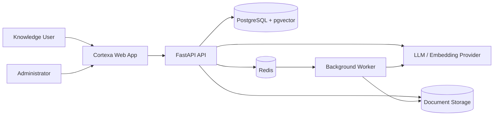
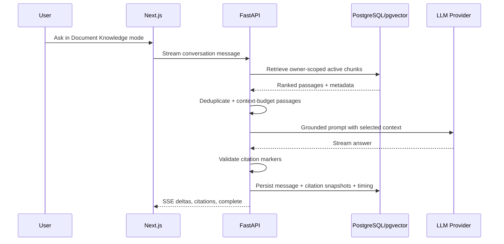
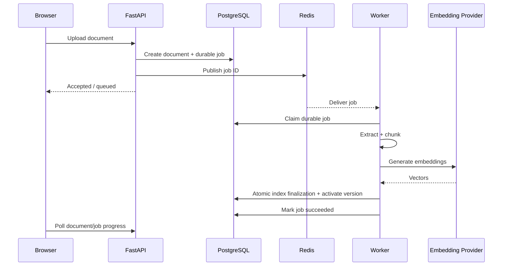
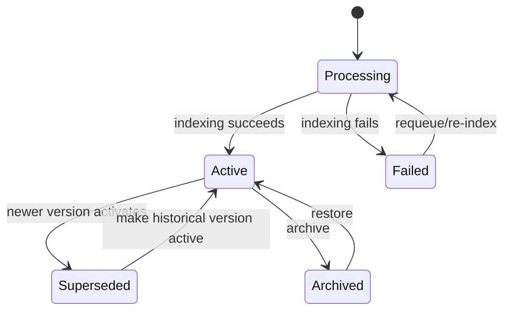
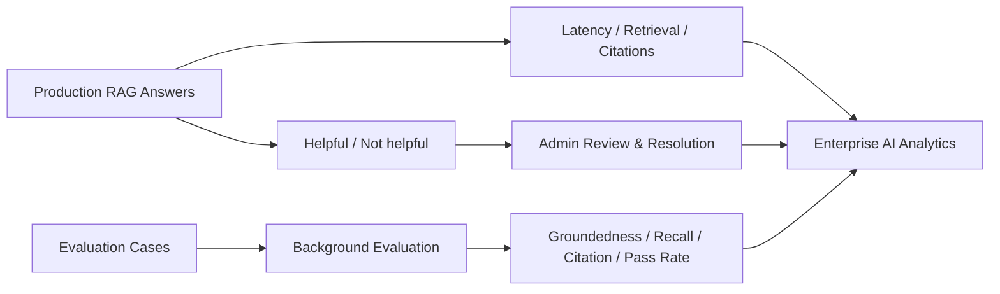
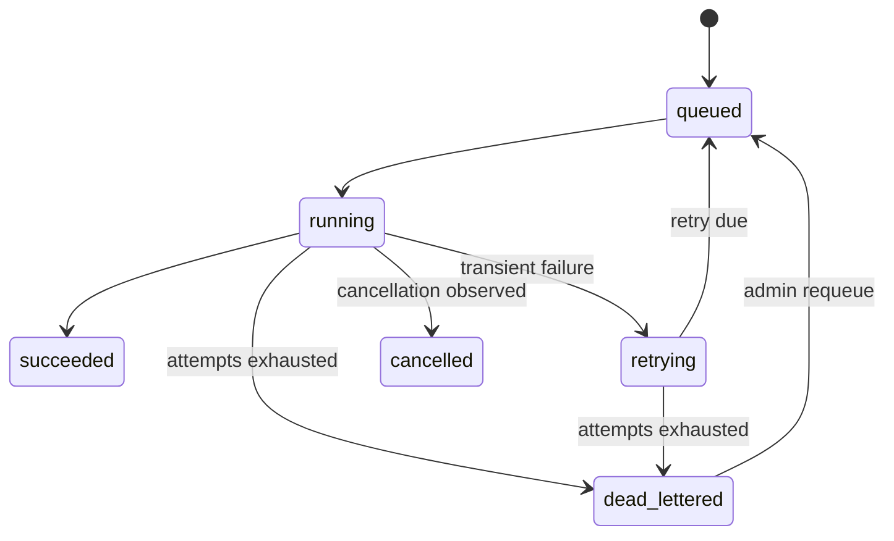

# Architecture Diagrams

These Mermaid diagrams render directly on GitHub and are intended for technical reviewers and portfolio walkthroughs.

## 1. System context

## 2. Grounded RAG request

## 3. Background document ingestion

## 4. Knowledge version lifecycle

Only the active, ready, non-archived version is eligible for normal RAG retrieval.

## 5. AI quality feedback loop

## 6. Durable job state

